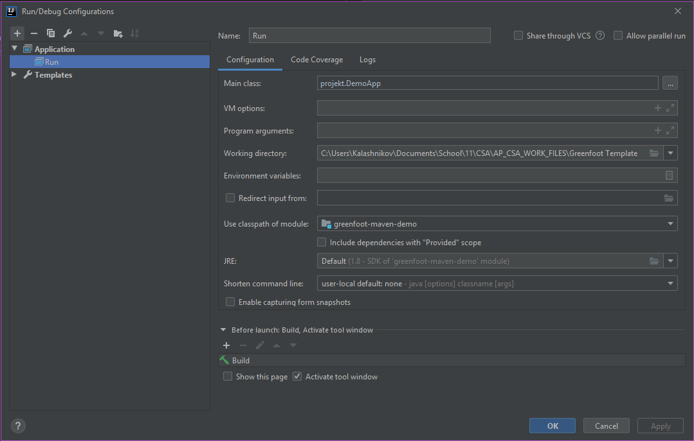

# Greenfoot Maven Demo

This is a simple Game showcasing Greenfoot development using Maven only.

## Building/Running

There are many ways to build and run this, I will only cover two of them.

### Prerequisites

In any case, you'll need to clone this repo. You can do this by using any Git GUI Client or simply the command line:

Also make sure, you have the following tools installed:

- Java 8 (JDK)
- Maven
- IntelliJ or any Java IDE (GUI way only)

### Command line

To build and run this, do the following in a terminal:

```
$ cd greenfoot-maven-demo
$ mvn clean install -DskipTests
$ java -jar target/greenfoot-maven-demo-1.0-SNAPSHOT-jar-with-dependencies.jar
```

If you try to use the jar without bundled dependencies it **WILL NOT WORK**!

### GUI

Open the `pom.xml` as a new project in IntelliJ or your IDE and switch on auto import for Maven.

If the import is done, create a new run configuration similar to the following:



You should now be able to run the game and even debug it!
